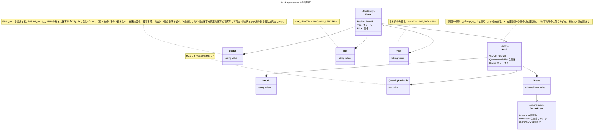

```mermaid
---
title: BookAggregation（書籍集約）
---
classDiagram
    class Book {
        <<RootEntity>>
        BookId: BookId
        Title: タイトル
        Price: 価格
    }

    class Stock {
        <<Entity>>
        StockId: StockId
        QuantityAvailable: 在庫数
        Status: ステータス
    }

    class BookId {
        +stirng value
    }

    class Title {
        +stirng value
    }

    class Price {
        +stirng value
    }

    class StockId {
        +stirng value
    }

    class QuantityAvailable {
        +int value
    }

    class Status {
        +StatusEnum value
    }

    class StatusEnum {
        <<enumeration>>
        InStock: 在庫あり
        LowStock: 在庫残りわずか
        OutOfStock: 在庫切れ
    }

    Book "1" --> "1" Stock
    Book --* BookId
    Book --* Title
    Book --* Price

    Stock --* StockId
    Stock --* QuantityAvailable
    Stock --* Status
    Status --> StatusEnum

    note for BookId "ISBNコードを適用する。\nISBNコードは、ISBNのあとに数字で「978」、\nさらにグループ（国・地域）番号（日本は4）、出版社番号、書名番号、の合計12桁の数字を並べ、\n最後にこの12桁の数字を特定の計算式で演算して得た1桁のチェック用の数を付け加えたコード。"
    note for Title "MAX_LENGTH = 1000\nMIN_LENGTH = 1"
    note for Price "日本円のみ扱う。\nMAX = 1,000,000\nMIN = 1"
    note for Stock "- 初回作成時、ステータスは「在庫切れ」から始まる。\n- 在庫数は0の場合は在庫切れ。10以下の場合は残りわずか。それ以外は在庫あり。"
    note for QuantityAvailable "MAX = 1,000,000\nMIN = 1"
```
